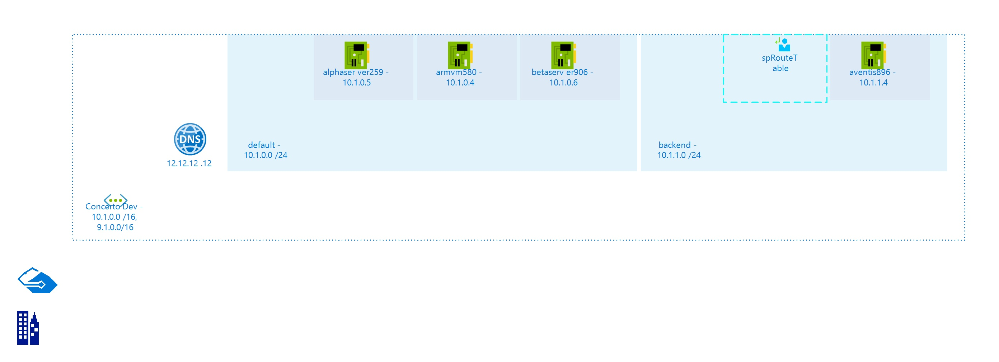

# ConcertoDev
 
## Settings

| Name | ConcertoDev  |
| --- | --- |
| Address Space | 10.1.0.0/16, 9.1.0.0/16  |
| Location | eastus  |
| Provisioning State | Succeeded  |
| State |   |

## Subnets

## Subnet default

### Settings

| Adress Prefix | 10.1.0.0/24  |
| --- | --- |
| Network Security Group |   |
| Route Table |   |

 ### IP Configurations

| Name | Public IP Address | Private IP Address | Private IP Allocation Method |
| --- | --- | --- | --- |
| ipconfig1  |   | 10.1.0.4  | Dynamic  |
| ipconfig1  |   | 10.1.0.5  | Dynamic  |
| ipconfig1  |   | 10.1.0.6  | Dynamic  |
 ## Subnet backend

### Settings

| Adress Prefix | 10.1.1.0/24  |
| --- | --- |
| Network Security Group |   |
| Route Table | [spRouteTable](spRouteTable--2085721850.md)  |

 ### IP Configurations

| Name | Public IP Address | Private IP Address | Private IP Allocation Method |
| --- | --- | --- | --- |
| ipconfig1  |   | 10.1.1.4  | Dynamic  |
 

## DNS Servers
The following DNS Servers are defined in the Virtual Network:
- 12.12.12.12

## Billing
 Total cost : 
