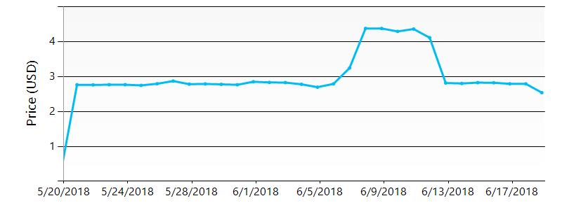

# Executive summary 
  
    
 This document was generated at the following date : 6/19/2018.  
 This document was generated for the subscription(s) :  
 
  
   
 The following Azure data centers are used in your deployment:  
    
| Location | Number of resources |
| --- | --- |
| japaneast  | 7  |
| global  | 1  |
| westeurope  | 1  |
| northeurope  | 2  |
| centralindia  | 1  |
| westus  | 13  |
| northcentralus  | 2  |
| canadaeast  | 16  |
| eastus  | 179  |
| southcentralus  | 6  |
| eastus2  | 50  |
| centralus  | 23  |
  
 The following components are used in your deployment:  
    
 
| Component | Number |
| --- | --- |
  
    
 , your Azure consumption is split across the following categories:  
    
 , your Azure consumption has the following trend:  
    
 , the components that are the most expensive are the following:  
    
 Â   
  
 
# Filters for document generation
  
 The following filters have been applied for the resource types:  
 
| Component |  Explicitly excluded (Filters) |
| --- | --- |
  
 The following filters have been applied for resource groups to explicitly include:   
 The following filters have been applied for resource groups to explicitly exclude:   
 Changes detected  
 The following changes have been detected since the :  
    
 

| Component | Added | Deleted | Changed | Unchanged |
  
 Assesment  
    
 

|   | Name | Availability | Best Practices | Security | Performance | Billing |
| Storages |
| Virtual Machines |
| Web App |
