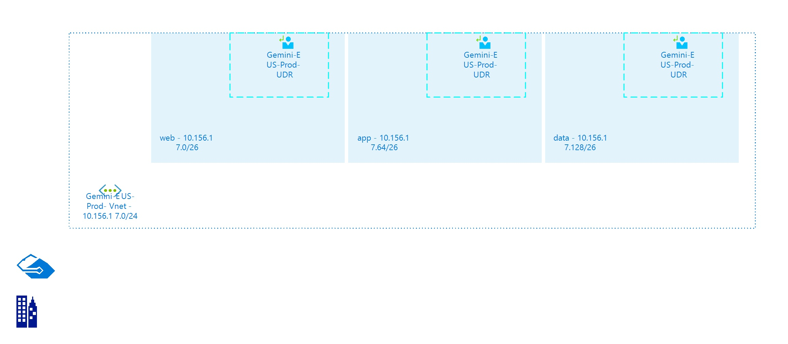

# Gemini-EUS-Prod-Vnet
 
## Settings

| Name | Gemini-EUS-Prod-Vnet  |
| --- | --- |
| Address Space | 10.156.17.0/24  |
| Location | eastus  |
| Provisioning State | Succeeded  |
| State |   |

## Subnets

## Subnet web

### Settings

| Adress Prefix | 10.156.17.0/26  |
| --- | --- |
| Network Security Group |   |
| Route Table | [Gemini-EUS-Prod-UDR](Gemini-EUS-Prod-UDR-1755423077.md)  |

 ## Subnet app

### Settings

| Adress Prefix | 10.156.17.64/26  |
| --- | --- |
| Network Security Group |   |
| Route Table | [Gemini-EUS-Prod-UDR](Gemini-EUS-Prod-UDR-1755423077.md)  |

 ## Subnet data

### Settings

| Adress Prefix | 10.156.17.128/26  |
| --- | --- |
| Network Security Group |   |
| Route Table | [Gemini-EUS-Prod-UDR](Gemini-EUS-Prod-UDR-1755423077.md)  |

 
## Billing
 Total cost : 
