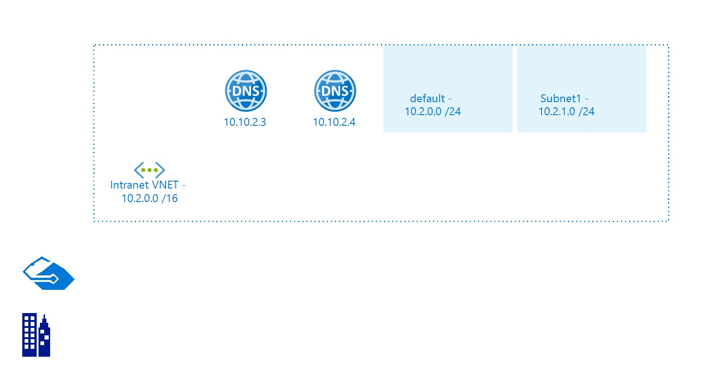

# IntranetVNET
 
## Settings

| Name | IntranetVNET  |
| --- | --- |
| Address Space | 10.2.0.0/16  |
| Location | eastus  |
| Provisioning State | Succeeded  |
| State |   |

## Tags

| Tag Key | Tag Value |
| --- | --- |
| key  | DelayService  |

## Subnets

## Subnet default

### Settings

| Adress Prefix | 10.2.0.0/24  |
| --- | --- |
| Network Security Group |   |
| Route Table |   |

 ## Subnet Subnet1

### Settings

| Adress Prefix | 10.2.1.0/24  |
| --- | --- |
| Network Security Group |   |
| Route Table |   |

 

## DNS Servers
The following DNS Servers are defined in the Virtual Network:
- 10.10.2.3

- 10.10.2.4

## Billing
 Total cost : 
