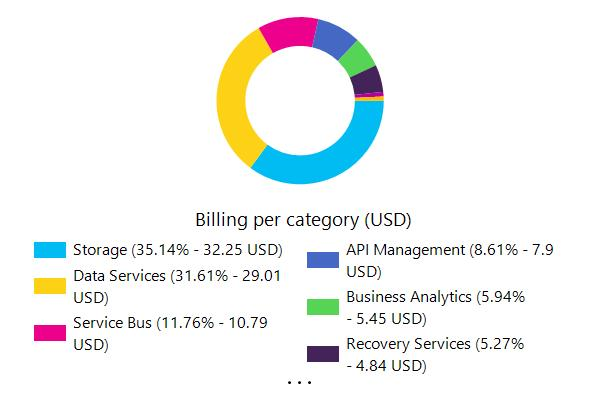

# Executive summary 
  
   
This document was generated at the following date : 6/19/2018.  
This document was generated for the subscription(s) :  

- Visual Studio Premium with MSDN - PASCALWANADOO(275ddf79-b240-44e7-9916-f24175b451b1)

  
   
The following Azure data centers are used in your deployment:  
   

| Location | Number of resources |
| --- | --- |
| japaneast  | 7  |
| global  | 1  |
| westeurope  | 1  |
| northeurope  | 2  |
| centralindia  | 1  |
| westus  | 13  |
| northcentralus  | 2  |
| canadaeast  | 16  |
| eastus  | 179  |
| southcentralus  | 6  |
| eastus2  | 50  |
| centralus  | 23  |
  
The following components are used in your deployment:  
   

| Component | Number |
| --- | --- |
| App Service Environments  | 0  |
| App Services  | 0  |
| Application Gateways  | 0  |
| Application Insights  | 0  |
| Automations  | 0  |
| Azure Active Directories  | 0  |
| Azure SQL  | 0  |
| Batch  | 0  |
| Cloud Services  | 0  |
| Container Services  | 0  |
| Content Delivery Network  | 0  |
| Custom Role Definitions  | 0  |
| Data Lake Stores  | 0  |
| Document DBs  | 0  |
| Event Hubs  | 0  |
| IoT Hubs  | 0  |
| Key Vaults  | 0  |
| Logic Apps  | 0  |
| Management Locks  | 0  |
| Media Service  | 0  |
| Network Security Groups  | 0  |
| Notification Hubs  | 0  |
| Policy Assignments  | 0  |
| Policy Definitions  | 0  |
| Public IPs  | 0  |
| Recovery Service Vault  | 0  |
| Redis  | 0  |
| Remote Apps  | 0  |
| Resource Groups  | 84  |
| Route Tables  | 0  |
| Schedulers  | 0  |
| SearchServices  | 0  |
| Service Bus  | 0  |
| Service Fabric Clusters  | 0  |
| Storage Accounts  | 0  |
| Storage Accounts (Classic)  | 0  |
| Stream Analytics  | 0  |
| Traffic Managers  | 0  |
| Virtual Machines  | 0  |
| Virtual Machines (Classic)  | 0  |
| Virtual Machines Scale Sets  | 0  |
| Virtual Network  | 0  |
| Virtual Network (Classic)  | 0  |
  
   
For the period between 5/20/2018 and 6/19/2018, your Azure consumption is split across the following categories:  
   
For the period between 5/20/2018 and 6/19/2018, your Azure consumption has the following trend:  
   
For the period between 5/20/2018 and 6/19/2018, the components that are the most expensive are the following:  
   
   
  

# Filters for document generation
  
The following filters have been applied for the resource types:  

| Component |  Explicitly excluded (Filters) |
| --- | --- |
| App Service Environments  | True  |
| App Services  | True  |
| Application Gateways  | True  |
| Application Insights  | True  |
| Automations  | True  |
| Azure Active Directories  | True  |
| Azure SQL  | True  |
| Batch  | True  |
| Cloud Services  | True  |
| Container Services  | True  |
| Content Delivery Network  | True  |
| Custom Role Definitions  | True  |
| Data Lake Stores  | True  |
| Document DBs  | True  |
| Event Hubs  | True  |
| IoT Hubs  | True  |
| Key Vaults  | True  |
| Logic Apps  | True  |
| Management Locks  | True  |
| Media Service  | True  |
| Network Security Groups  | True  |
| Notification Hubs  | True  |
| Policy Assignments  | True  |
| Policy Definitions  | True  |
| Public IPs  | True  |
| Recovery Service Vault  | True  |
| Redis  | True  |
| Remote Apps  | True  |
| Resource Groups  | False  |
| Route Tables  | True  |
| Schedulers  | True  |
| SearchServices  | True  |
| Service Bus  | True  |
| Service Fabric Clusters  | True  |
| Storage Accounts  | True  |
| Storage Accounts (Classic)  | True  |
| Stream Analytics  | True  |
| Traffic Managers  | True  |
| Virtual Machines  | True  |
| Virtual Machines (Classic)  | True  |
| Virtual Machines Scale Sets  | True  |
| Virtual Network  | True  |
| Virtual Network (Classic)  | True  |
  
The following filters have been applied for resource groups to explicitly include:   
The following filters have been applied for resource groups to explicitly exclude:   
Changes detected  
The following changes have been detected since the :  
   

| Component | Added | Deleted | Changed | Unchanged |
  
Assesment  
   

|   | Name | Availability | Best Practices | Security | Performance | Billing |
| Storages |
| Virtual Machines |
| Web App |
