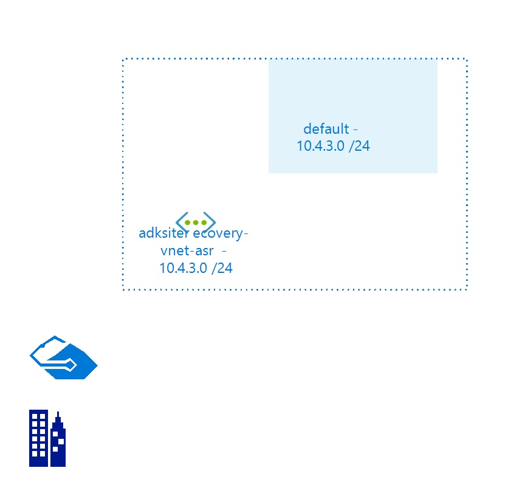

# adksiterecovery-vnet-asr
 
## Settings

| Name | adksiterecovery-vnet-asr  |
| --- | --- |
| Address Space | 10.4.3.0/24  |
| Location | northcentralus  |
| Provisioning State | Succeeded  |
| State |   |

## Subnets

## Subnet default

### Settings

| Adress Prefix | 10.4.3.0/24  |
| --- | --- |
| Network Security Group |   |
| Route Table |   |

 

## Billing
 Total cost : 
