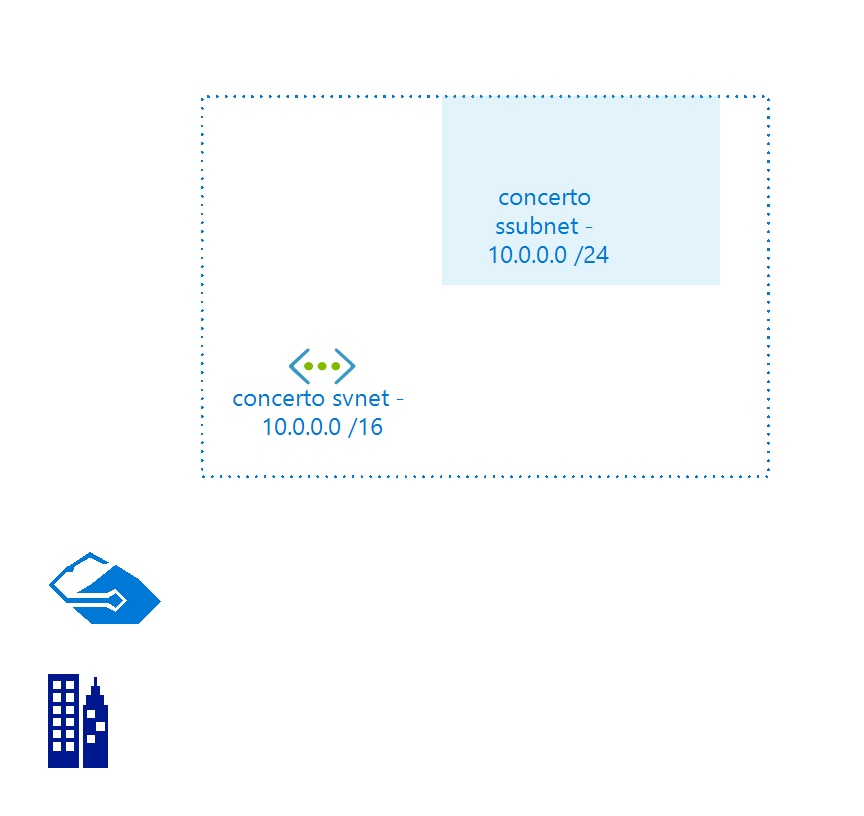

# concertosvnet
 
## Settings

| Name | concertosvnet  |
| --- | --- |
| Address Space | 10.0.0.0/16  |
| Location | eastus  |
| Provisioning State | Succeeded  |
| State |   |

## Subnets

## Subnet concertossubnet

### Settings

| Adress Prefix | 10.0.0.0/24  |
| --- | --- |
| Network Security Group |   |
| Route Table |   |

 

## Billing
 Total cost : 
