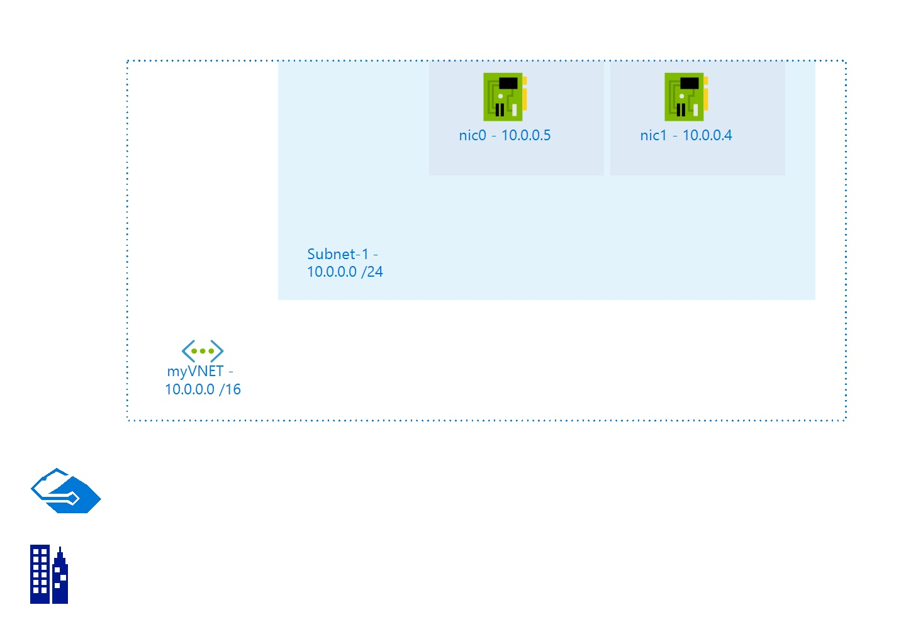

# myVNET
 
## Settings

| Name | myVNET  |
| --- | --- |
| Address Space | 10.0.0.0/16  |
| Location | eastus  |
| Provisioning State | Succeeded  |
| State |   |

## Subnets

## Subnet Subnet-1

### Settings

| Adress Prefix | 10.0.0.0/24  |
| --- | --- |
| Network Security Group |   |
| Route Table |   |

 
### IP Configurations

| Name | Public IP Address | Private IP Address | Private IP Allocation Method |
| --- | --- | --- | --- |
| ipconfig1  |   | 10.0.0.4  | Dynamic  |
| ipconfig1  |   | 10.0.0.5  | Dynamic  |
 

## Billing
 Total cost : 
