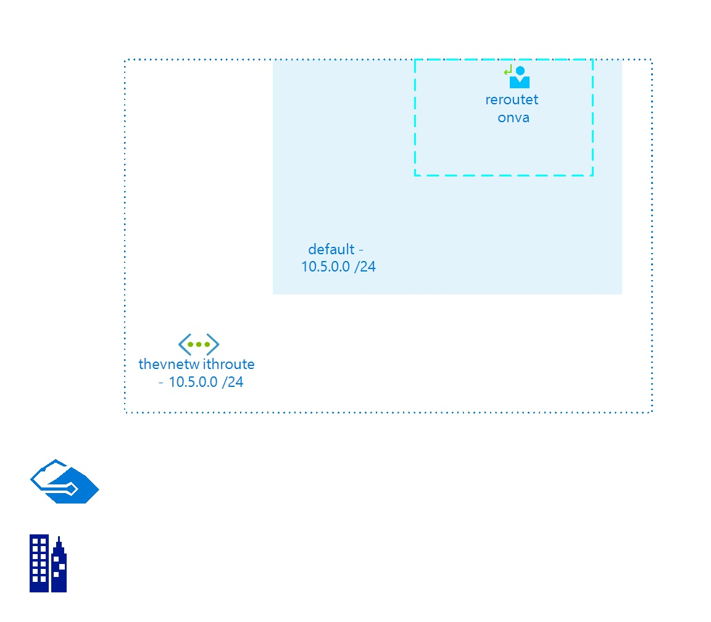

# thevnetwithroute
 
## Settings

| Name | thevnetwithroute  |
| --- | --- |
| Address Space | 10.5.0.0/24  |
| Location | eastus2  |
| Provisioning State | Succeeded  |
| State |   |

## Subnets

## Subnet default

### Settings

| Adress Prefix | 10.5.0.0/24  |
| --- | --- |
| Network Security Group |   |
| Route Table | [reroutetonva](reroutetonva--747290517.md)  |

 
## Billing
 Total cost : 
